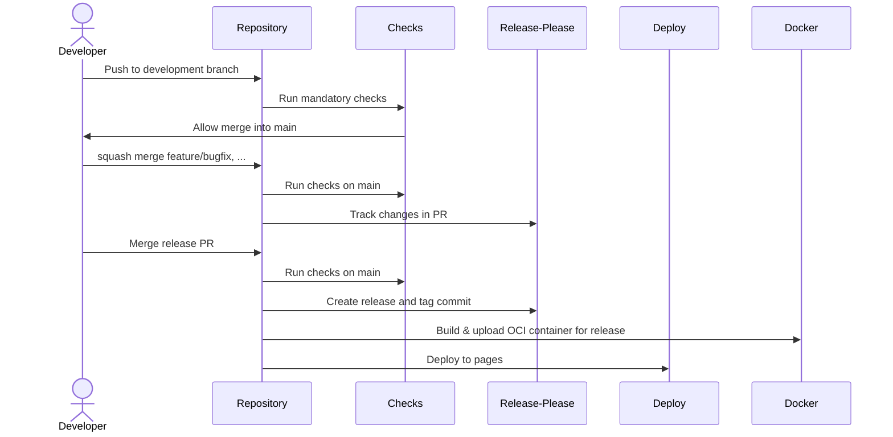

<div align="center">
    
</div>

<div align="center">
    <h2>Brunsviga 13 RK emulator</h2>
    <p>
        Web based emulation of the Brunsviga 13 RK
        mechanical calculator from the 1950s.
    </p>
</div>

# Technology

For the purpose of simplicity and due to the small scale of this project the
following list of frameworks and build systems was chosen:

- Vite (for building)
- React (simple UI)
- Three.js (WebGL abstraction)
- Typescript (typesafe(r) Javascript)
- Tailwind CSS (styling through classes)

# Quick Start

Make sure you have `npm` and `git` installed. Clone this repository and run the
following commands:
```sh
npm install && npm run dev .
```
This will install all required dependencies and start the emulation by
running a web server on port `5173`. You can now visit:
[http://localhost:5173](http://localhost:5173).

# Docker

Alternatively to compiling and running the emulation natively with node,
a ready to use Dockerfile can be used to build and run the emulation.
First, build the image:
```sh
docker build --tag brunsviga13rk/emulation:git .
```
Then you can create a container from the image and bind it to a local port:
```sh
docker run -p 8080:80 brunsviga13rk/emulation:git
```
You can now visit:
[http://localhost:8080](http://localhost:8080).

# Workflow

The workflow for developer looks like the following:
Features, bugfixes or other works are committed to in dedicated branches
categorized by the work done in them. For example a feature "add XYZ" maybe
developed in a branch "feat/add-xyz". When ready this branch is squash merged
into main. An action will automatically add the changes to a release pull
request and increment the version number if needed. When a new version shall
be released the release pull request is merged and automatically, the container
image is build and pushed to GHCR. Additionally the application is deployed to
a GitHub page [here](https://brunsviga13rk.github.io/emulator/).


